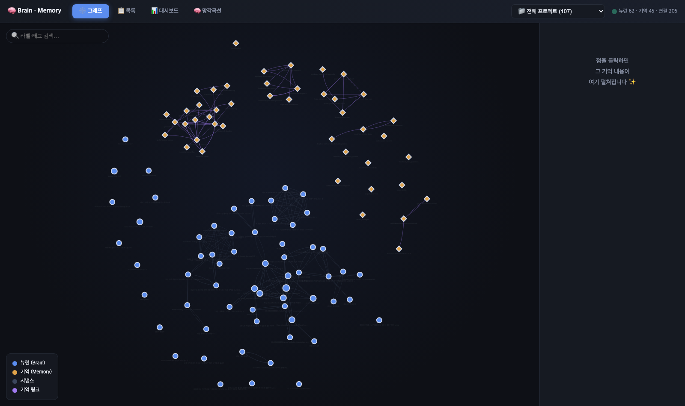
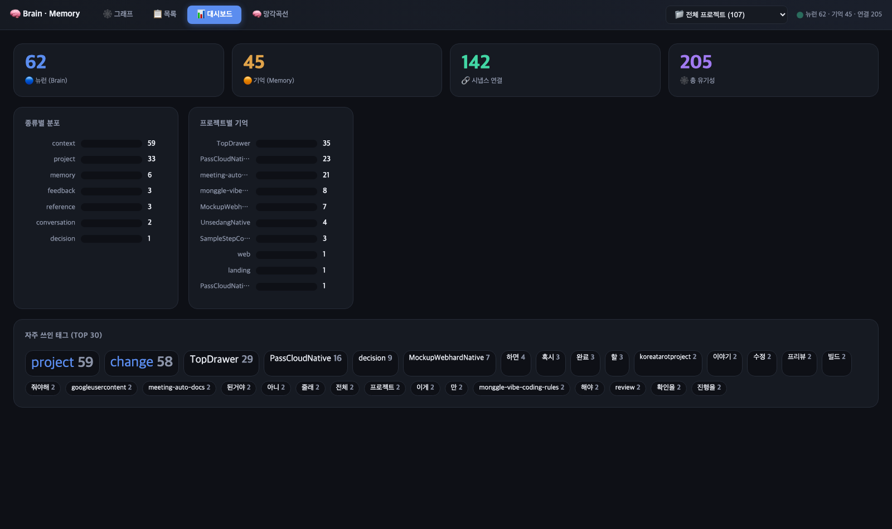
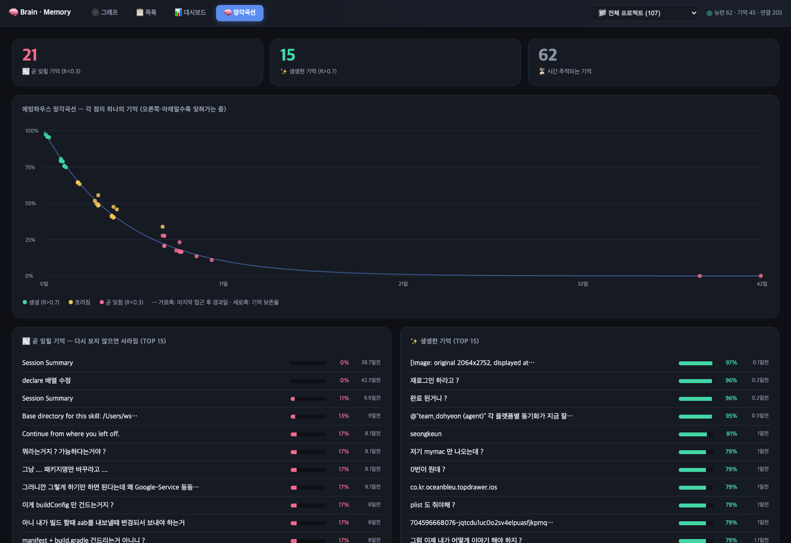

# Vibe Coding Skills for Claude

<div align="center">

**"Claude는 쓰는데, 잘 쓰는 법은 다릅니다"**

[](https://github.com/loboking/monggle-vibe-coding-rules)

**Claude Code를 더 잘 쓰기 위한 스킬 모음**

</div>

---

## 🚀 빠른 시작

```bash
git clone https://github.com/loboking/monggle-vibe-coding-rules.git
cd monggle-vibe-coding-rules
./install.sh
```

---

## ⬆️ 업그레이드 방법

툴킷(스킬·라이브러리) 자체를 최신 버전으로 올릴 때는 `/monggle-upgrade` 한 줄이면 됩니다.
GitHub 최신 버전 확인 → `git pull` → `install.sh` 재실행(글로벌 동기화)까지 한 번에 처리합니다.

```bash
/monggle-upgrade               # 최신 버전 확인 후 자동 업그레이드 (하루 1회 스로틀)
/monggle-upgrade --check-only  # 업데이트 여부만 확인 (설치 안 함)
/monggle-upgrade --force       # 하루 1회 제한 무시하고 즉시 재확인
```

> **`/monggle-upgrade` vs `/update`**
> - `/monggle-upgrade` = **툴킷 자체 최신화**(버전 비교 + `git pull` + `install.sh` 재실행). 평소엔 이걸 쓰세요.
> - `/update` = **현재 작업 브랜치를 원격과 동기화**하는 범용 git pull 도우미. 툴킷 업그레이드 목적이면 `/monggle-upgrade`를 사용하세요.

---

## 💡 자주 쓰는 명령어 (Top 10)

| 명령어 | 설명 |
|--------|------|
| `/help` | 전체 명령어 보기 |
| `/init` | 초기 설정 (최초 1회) |
| `/prd` | 기획서 생성 |
| `/debug` | 디버깅 |
| `/qa` | 테스트 |
| `/review` | 코드 리뷰 |
| `/changelog` | 변경 로그 |
| `/push-safe` | 안전한 Git push |
| `/brain` | 뇌 시스템 (기억) |
| `/brain-web` | 기억·연결·망각 로컬 웹 시각화 |
| `/team-builder` | 인격 가진 에이전트 팀 채용 |

---

## 🔗 monggle- 접두사 별칭

`monggle-` 접두사를 사용하여 동일한 스킬 호출 가능:

| 별칭 | 원본 | 호출 방법 |
|-----|------|----------|
| `monggle-super` | `super.md` | 자연어: `Use monggle-super to expand...` |
| `monggle-gemini` | `gemini.md` | 자연어: `Use monggle-gemini to analyze...` |
| `monggle-brain` | `smart-brain.md` | 자연어: `Use monggle-brain to remember...` |
| `monggle-init` | `project-init.md` | 자연어: `Use monggle-init to setup...` |
| `monggle-planner` | `product-manager.md` | 자연어: `Use monggle-planner to plan...` |

**참고:** 이 스킬들은 Agent 형태로 제공되며 자연어로 호출합니다.

---

## 🧠 Brain 시각화 (`/brain-web`)

뇌 시스템에 쌓인 **기억·연결(유기성)·망각**을 로컬 웹에서 본다. 빌드 도구 없이 단일 HTML — `bash ~/.claude/skills/brain-web/serve.sh` 한 줄로 띄운다. 상단 드롭다운으로 **프로젝트 단위 필터**.

### 🕸 그래프 — 기억 간 연결(시냅스) 한눈에
뉴런(🔵)·기억(🟠)을 노드로, 시냅스·기억링크를 엣지로. 노드 클릭 → 내용 패널.



### 📊 대시보드 — 종류·프로젝트·태그 분포
카운트업 숫자 + 종류별/프로젝트별 막대 + 태그 클라우드.



### 🧠 망각곡선 — 에빙하우스 기반 기억 보존율
각 기억을 (경과일, 보존율) 점으로 산포. **회상할수록 강화**되어 천천히 잊힌다. 곧 잊힐 기억·생생한 기억 Top 15.



> 망각 강도 `S = 2 + access_count×3 + emotional_weight×5`, `retention = exp(-경과일/S)`.
> 회상(`brain_query_by_tags`) 시 access_count가 +1 되어 곡선이 살아난다.

---

## 👥 Team Builder (`/team-builder`)

에이전트를 **일회용 도구가 아니라 "기억과 인격을 가진 사람"**으로 채용·성장시키는 스킬. 팀장을 만들고, 팀장이 필요할 때 팀원을 자가 채용한다. 중복 감지 시 자동 **UPGRADE**(memory 보존).

- 각 사람 = `persona.md`(불변 정체성) + `skills.md`(손발) + `memory/`(누적 기억)
- `@team_<slug>`로 어느 프로젝트에서든 같은 인격으로 호출, 프로젝트별 기억은 분리
- 직군: 설계자·구현자·리뷰어·테스터·디버거·기획자·마케터·리서처 — 기존 스킬을 손발로 재활용

```
팀장 도현 → 설계 나루 · 구현 태오 · 리뷰 세린 · 테스터 다빈 · 디버거 준
```

---

## 📖 상세 문서

| 문서 | 설명 |
|------|------|
| [GUIDE.md](GUIDE.md) | 전체 사용 가이드 |
| [CHANGELOG.md](CHANGELOG.md) | 변경 로그 |

---

## 🎯 주요 기능

- **📋 PRD 템플릿** - 구조화된 요구사항 정의
- **🤖 Agent Pipeline** - PRD 기반 자동 코드 생성
- **🔍 코드 품질** - 린트, 보안 스캔, 복잡도 분석
- **📚 문서 자동화** - CHANGELOG, API 문서 자동 생성
- **🧠 뇌 시스템** - 맥락 기억, 망각 곡선, 시냅스 연결
- **🕸 Brain 시각화** - 기억 그래프·대시보드·망각곡선 로컬 웹 (`/brain-web`)
- **👥 Team Builder** - 인격·기억 가진 에이전트 팀 자가 채용 (`/team-builder`)
- **🔄 Git 협업** - 안전한 동기화, 충돌 해결

---

## ✨ 특징

- ✅ 오타 자동 교정 (`/qaa` → `/qa`)
- ✅ 의도 기반 스킬 실행 ("너무 느려" → `/bottleneck`)
- ✅ 다국어 PRD (한국어/영어/중국어/일본어)

---

## 📜 License

[MIT License](LICENSE)

---

<div align="center">

Made with ❤️ by [loboking](https://github.com/loboking)

</div>
