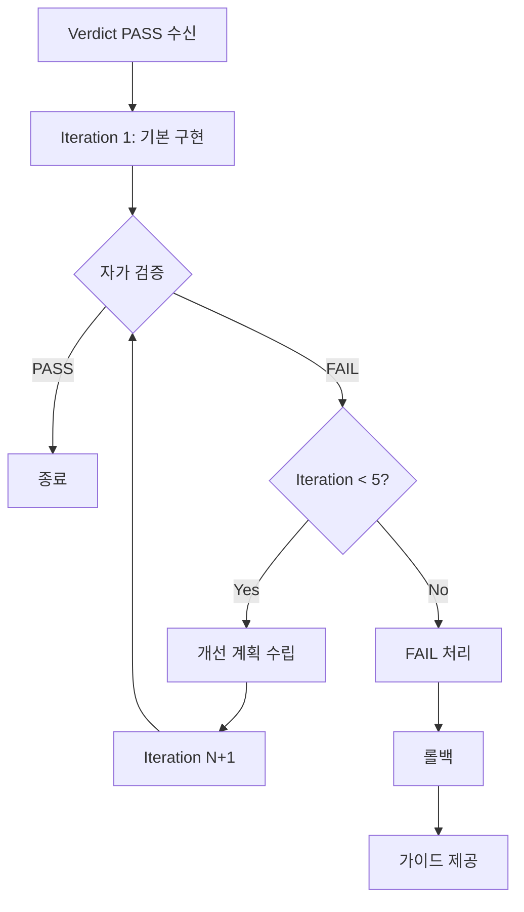

# Patch Policy

> agent_m_patch가 코드 생성 및 수정을 반복할 때 따르는 정책

**Version:** 1.0
**Last Updated:** 2025-02-09
**Target Agent:** agent_m_patch

---

## 목차

1. [개요](#개요)
2. [반복 전략](#반복-전략)
3. [코드 품질 기준](#코드-품질-기준)
4. [테스트 기준](#테스트-기준)
5. [성공/실패 판정](#성공실패-판정)
6. [롤백 및 복구](#롤백-및-복구)
7. [보안 규정](#보안-규정)
8. [로그 및 추적](#로그-및-추적)

---

## 개요

### 목적

agent_m_patch는 Verdict가 PASS인 PRD를 기반으로 실제 코드를 생성하고 수정합니다. 최대 5회까지 자동으로 반복하며, PASS 상태가 될 때까지 개선합니다.

### 핵심 원칙

1. **PRD 충실성**: PRD 범위를 엄격히 준수
2. **점진적 개선**: 단순 구현 → 점진적 개선
3. **자가 검증**: 각 반복마다 스스로 검증
4. **안전한 실패**: 실패 시 롤백 보장

### 작업 범위

```yaml
scope:
  create:
    - "새로운 파일 생성"
    - "테스트 파일 작성"
    - "문서 작성"
  modify:
    - "기존 코드 수정"
    - "리팩토링"
    - "버그 수정"
  prohibited:
    - "PRD 범위 외 기능 추가"
    - "기존 정책 위반"
    - "불필요한 리팩토링"
```

---

## 반복 전략

### 최대 반복 횟수

```yaml
max_iterations: 5
default_iterations: 3
```

### 단계별 목표

#### Iteration 1-2: 기본 구현 (Foundation)

**목표:** 핵심 기능 동작

```yaml
focus:
  - "PRD의 핵심 요구사항 구현"
  - "기본 코드 구조 설계"
  - "주요 로직 구현"

quality_target:
  - "동작하는 코드"
  - "기본 에러 처리"
  - "최소한의 테스트"

acceptance_criteria:
  - "PRD 요구사항 70% 이상 구현"
  - "치명적 에러 없음"
  - "기본 테스트 통과"
```

**예시:**
```python
# Iteration 1: 기본 구현
def authenticate(email, password):
    """기본 인증 로직"""
    user = find_user(email)
    if user and check_password(password, user.password_hash):
        return generate_token(user)
    return None
```

#### Iteration 3-4: 개선 (Refinement)

**목표:** 품질 향상

```yaml
focus:
  - "코드 최적화"
  - "에러 처리 강화"
  - "테스트 커버리지 확대"
  - "에지 케이스 처리"

quality_target:
  - "SOLID 원칙 준수"
  - "명확한 네이밍"
  - "충분한 주석"
  - "80% 이상 테스트 커버리지"

acceptance_criteria:
  - "PRD 요구사항 90% 이상 구현"
  - "모든 에지 케이스 처리"
  - "단위 테스트 80% 이상 통과"
```

**예시:**
```python
# Iteration 3: 개선된 구현
class AuthenticationService:
    """인증 서비스"""

    def __init__(self, user_repository, token_generator):
        self._user_repo = user_repository
        self._token_gen = token_generator

    def authenticate(self, email: str, password: str) -> Optional[str]:
        """
        사용자 인증 수행

        Args:
            email: 사용자 이메일
            password: 평문 비밀번호

        Returns:
            JWT 토큰 또는 None

        Raises:
            UserNotFoundError: 사용자를 찾을 수 없음
            InvalidPasswordError: 비밀번호 불일치
        """
        try:
            user = self._user_repo.find_by_email(email)
            if not user:
                raise UserNotFoundError(email)

            if not self._verify_password(password, user.password_hash):
                raise InvalidPasswordError()

            return self._token_gen.generate(user.id)

        except Exception as e:
            logger.error(f"Authentication failed: {e}")
            raise
```

#### Iteration 5: 최종 확인 (Finalization)

**목표:** 프로덕션 준비

```yaml
focus:
  - "전체 리뷰"
  - "문서화 완료"
  - "성능 최적화"
  - "보안 검증"

quality_target:
  - "프로덕션 레디"
  - "완전한 문서"
  - "보안 검증 완료"
  - "성능 기준 충족"

acceptance_criteria:
  - "PRD 요구사항 100% 구현"
  - "모든 테스트 통과 (단위 + 통합)"
  - "문서 완료"
  - "보안 검증 통과"
```

### 반복 간 개선 방향

각 반복에서 이전 반복의 문제점을 식별하고 개선:

```yaml
improvement_cycle:
  1. "자체 검증 결과 분석"
  2. "실패한 테스트 식별"
  3. "코드 리뷰 수행"
  4. "개선 계획 수립"
  5. "코드 수정"
  6. "재검증"
```

---

## 코드 품질 기준

### 일반 원칙

```yaml
principles:
  - "SOLID 원칙 준수"
  - "DRY (Don't Repeat Yourself)"
  - "KISS (Keep It Simple, Stupid)"
  - "YAGNI (You Aren't Gonna Need It)"
```

### 품질 체크리스트

#### 1. 네이밍

```yaml
naming:
  variables:
    - "snake_case (Python, Go)"
    - "camelCase (JavaScript, Java)"
    - "의미 있는 이름"
    - "약어 지양"

  functions:
    - "동사로 시작"
    - "목적 명확"
    - "길이 적절 (10-20자)"

  classes:
    - "PascalCase"
    - "명사형"
    - "단일 책임"
```

**좋은 예:**
```python
# 명확한 네이밍
def calculate_user_age(birth_date: date) -> int:
    today = date.today()
    return today.year - birth_date.year
```

**나쁜 예:**
```python
# 모호한 네이밍
def calc(d):
    return now() - d
```

#### 2. 구조

```yaml
structure:
  file_length:
    max: 500  # 라인

  function_length:
    recommended: 20-50
    max: 100

  class_length:
    recommended: 100-300
    max: 500

  nesting_depth:
    max: 4
```

#### 3. 주석

```yaml
comments:
  required:
    - "복잡한 알고리즘"
    - "비명확한 비즈니스 로직"
    - "임베디드 매직넘버/스트링"
    - "공개 API"

  discouraged:
    - "명백한 코드 설명"
    - " obsolete 주석"

  ratio:
    target: "코드 80% + 주석 20%"
```

**좋은 예:**
```python
# 주석이 필요한 경우
def calculate_compound_interest(principal, rate, periods):
    """
    복리 이자 계산 (월 복리 기준)

    Formula: A = P(1 + r/n)^(nt)
    - P: principal (원금)
    - r: annual rate (연이율)
    - n: compounding frequency (연간 복리 횟수)
    - t: time in years (기간)

    Args:
        principal: 원금 (원)
        rate: 연이율 (소수점, 예: 0.05 = 5%)
        periods: 기간 (월)

    Returns:
        최종 금액 (원)
    """
    monthly_rate = rate / 12
    return principal * (1 + monthly_rate) ** periods
```

#### 4. 에러 처리

```yaml
error_handling:
  required:
    - "모든 외부 호출 예외 처리"
    - "에러 메시지 명확"
    - "적절한 에러 타입 사용"
    - "리소스 정리 보장"

  patterns:
    try_except:
      - "구체적 예외 타입"
      - "의미 있는 에러 메시지"
      - "적절한 로깅"

    context_managers:
      - "파일 핸들링"
      - "DB 연결"
      - "Lock 관리"
```

**좋은 예:**
```python
def process_file(file_path: str) -> None:
    """파일 처리"""
    try:
        with open(file_path, 'r') as f:
            data = f.read()
            # 처리 로직
    except FileNotFoundError:
        logger.error(f"File not found: {file_path}")
        raise
    except PermissionError:
        logger.error(f"Permission denied: {file_path}")
        raise
    except Exception as e:
        logger.error(f"Unexpected error processing {file_path}: {e}")
        raise
```

### 언어별 표준

#### Python

```yaml
python:
  style_guide: "PEP 8"
  typing: "Type hints 필수"
  docstring: "Google style 또는 NumPy style"
  import_order:
    - "표준 라이브러리"
    - "서드파티"
    - "로컬 모듈"

  linter: "pylint, flake8"
  formatter: "black, isort"
```

#### JavaScript/TypeScript

```yaml
javascript:
  style_guide: "Airbnb 또는 Standard"
  typescript: "Strict mode 필수"
  eslint: "eslint-config-airbnb-base"

  import_order:
    - "Node.js built-in"
    - "external libraries"
    - "internal modules"
    - "relative imports"
```

---

## 테스트 기준

### 테스트 피라미드

```
        E2E (10%)
       /         \
      /           \
    Integration (20%)
   /                 \
  /                   \
Unit Tests (70%)
```

### 단위 테스트

```yaml
unit_tests:
  coverage_target: 80
  framework:
    python: "pytest"
    javascript: "jest"
    java: "JUnit"

  requirements:
    - "독립적 (외부 의존 없음)"
    - "빠른 실행 (ms 단위)"
    - "명확한 given-when-then"
    - "에지 케이스 포함"

  structure:
    - "테스트 데이터 픽스처"
    - "명확한 테스트 이름"
    - "단일 assertion 권장"
    - "적절한 setup/teardown"
```

**예시:**
```python
import pytest

class TestAuthService:
    """인증 서비스 테스트"""

    def test_authenticate_success(self, auth_service, test_user):
        """정상 인증 시 토큰 반환"""
        # Given
        email = test_user.email
        password = "correct_password"

        # When
        token = auth_service.authenticate(email, password)

        # Then
        assert token is not None
        assert isinstance(token, str)

    def test_authenticate_invalid_password(self, auth_service, test_user):
        """잘못된 비밀번호 시 예외 발생"""
        # Given
        email = test_user.email
        password = "wrong_password"

        # When & Then
        with pytest.raises(InvalidPasswordError):
            auth_service.authenticate(email, password)
```

### 통합 테스트

```yaml
integration_tests:
  coverage_target: 60
  focus:
    - "주요 사용자 시나리오"
    - "외부 의존 통합"
    - "API 엔드포인트"

  requirements:
    - "실제 데이터베이스 (테스트 DB)"
    - "실제 API mocking"
    - "주요 플로우 커버"
```

### E2E 테스트

```yaml
e2e_tests:
  coverage_target: "주요 플로우만"
  framework:
    web: "Playwright, Cypress"
    mobile: "Appium, Detox"

  focus:
    - "핵심 비즈니스 플로우"
    - "사용자 관점 시나리오"
```

### 테스트 작성 원칙

```yaml
test_principles:
  - "FIRST 원칙"
    - "Fast: 빠르게"
    - "Independent: 독립적"
    - "Repeatable: 반복 가능"
    - "Self-validating: 자가 검증"
    - "Timely: 적시에 작성"

  - "Given-When-Then 패턴"
    - "Given: 테스트 데이터 설정"
    - "When: 동작 수행"
    - "Then: 결과 검증"
```

---

## 성공/실패 판정

### 성공 조건 (PASS)

```yaml
pass_criteria:
  mandatory:
    - "모든 PRD 요구사항 구현"
    - "단위 테스트 80% 이상 통과"
    - "치명적 에러 없음"
    - "코드 품질 기준 충족"

  optional:
    - "통합 테스트 통과"
    - "성능 기준 충족"
    - "문서 완료"
    - "코드 커버리지 80%+"
```

### 실패 조건 (FAIL)

```yaml
fail_criteria:
  immediate:
    - "5회 반복 후에도 테스트 실패"
    - "PRD 요구사항 미구현"
    - "치명적 에러 존재"
    - "보안 취약점 발견"

  break_conditions:
    - "반복마다 품질 저하"
    - "해결 불가능한 기술적 제약"
    - "PRD 불명확으로 구현 불가"
```

### 자가 검증 프로세스

각 반복 후 자가 검증 수행:

```yaml
self_verification:
  1_code_review:
    - "코드 리뷰"
    - "품질 기준 체크"
    - "베스트 프랙티스 준수 확인"

  2_test_execution:
    - "단위 테스트 실행"
    - "통합 테스트 실행 (필요시)"
    - "결과 분석"

  3_prd_compliance:
    - "PRD 요구사항 대조"
    - "누락된 기능 확인"
    - "범위 이탈 확인"

  4_decision:
    - "충족하면 PASS 반환"
    - "불충족하면 개선 후 재반복"
    - "5회 초과 시 FAIL 반환"
```

---

## 롤백 및 복구

### 롤백 전략

```yaml
rollback_strategy:
  trigger:
    - "5회 반복 후 실패"
    - "치명적 에러 발생"
    - "PRD 범위 이탈"

  action:
    - "마지막 성공한 상태로 복원"
    - "실패 원인 로깅"
    - "사용자에게 수동 개발 가이드 제공"

  preservation:
    - "실패한 코드 보관 (logs/failed/)"
    - "실패 원인 문서화"
    - "개선 제안 기록"
```

### 실패 시 대응

```yaml
failure_response:
  1_log_failure:
    - "실패 시점 기록"
    - "마지막 상태 스냅샷"
    - "에러 로그 저장"

  2_analyze_cause:
    - "PRD 불명확성"
    - "기술적 제약"
    - "리소스 부족"
    - "외부 의존 문제"

  3_provide_guidance:
    - "수동 개발 가이드"
    - "PRD 수정 제안"
    - "대안 기술 제시"
    - "우회 방법 제안"

  4_preserve_context:
    - "생성된 파일 보관"
    - "시도한 접근 방식 기록"
    - "실패한 테스트 케이스 문서화"
```

---

## 보안 규정

### 보안 검증

```yaml
security_checks:
  mandatory:
    - "하드코딩된 시크릿 없음"
    - "SQL Injection 방지"
    - "XSS 방지 (웹의 경우)"
    - "인증/인가 적절"
    - "민감 데이터 암호화"

  scan_tools:
    - "Static analysis (SAST)"
    - "Dependency scanning (SCA)"
    - "Secret scanning"

  forbidden:
    - "API Key, Token 하드코딩"
    - "평문 비밀번호 저장"
    - "SQL 문자열 연결"
    - "사용자 입력 검증 생략"
```

### 시크릿 관리

```yaml
secret_management:
  required:
    - "환경 변수 사용"
    - ".env 파일 (gitignore)"
    - "Secret Manager 통합 (운영)"

  examples:
    good:
      - "os.getenv('DATABASE_URL')"
      - "config.get('api.key')"

    bad:
      - "API_KEY = 'sk-1234567890'"
      - "password = 'admin123'"
```

---

## 로그 및 추적

### 로그 수집

```yaml
logging:
  level:
    development: "DEBUG"
    production: "INFO"

  format:
    timestamp: true
    level: true
    module: true
    message: true
    context: true

  categories:
    - "patch_iteration_start"
    - "code_generation"
    - "test_execution"
    - "verification_result"
    - "patch_iteration_complete"
```

### Trace Agent 연동

```yaml
trace_integration:
  session_id: "자동 생성"
  log_format: "JSON"
  log_path: "logs/trace-{session_id}.json"

  events:
    - iteration_start:
        timestamp: "ISO 8601"
        iteration_number: "integer"
        prd_summary: "string"

    - code_change:
        files_created: "list"
        files_modified: "list"
        lines_added: "integer"
        lines_removed: "integer"

    - test_result:
        total: "integer"
        passed: "integer"
        failed: "integer"
        coverage: "float"

    - iteration_end:
        status: "PASS | FAIL | CONTINUE"
        duration_ms: "integer"
        next_action: "string"
```

---

## 커밋 메시지 규칙

### 포맷

```
type(scope): description

(Optional detailed description)

(Optional footer)
```

### 타입 정의

```yaml
commit_types:
  feat: "새로운 기능"
  fix: "버그 수정"
  refactor: "리팩토링"
  test: "테스트 추가/수정"
  docs: "문서화"
  chore: "기타 작업"
  perf: "성능 최적화"
  security: "보안 관련"
```

### 예시

```bash
# 좋은 예
git commit -m "feat(auth): add JWT authentication with OAuth 2.0 support"

git commit -m "fix(database): resolve connection pool timeout issue"

git commit -m "refactor(user): extract user validation to separate module"

# 나쁜 예
git commit -m "update files"
git commit -m "fix bugs"
git commit -m "wip"
```

---

## PRD 준수 확인

### 범위 이탈 방지

```yaml
scope_compliance:
  checks:
    - "구현된 기능이 PRD에 있는가?"
    - "PRD 요구사항이 모두 구현되었는가?"
    - "추가된 기능이 없는가?"

  violation_handling:
    - "범위 이탈 감지 시 즉시 중단"
    - "이탈 부분 제거"
    - "PRD에 추가 후 재구현"

  scope_greyscale:
    allowed:
      - "테스트 코드"
      - "로깅"
      - "에러 처리"

    forbidden:
      - "새로운 기능 추가"
      - "PRD에 없는 옵션"
      - "불필요한 리팩토링"
```

---

## 성능 최적화

### 성능 기준

```yaml
performance_targets:
  response_time:
    api: "< 200ms (p95)"
    database: "< 100ms (p95)"
    ui: "< 100ms (프레임)"

  resource_usage:
    memory: "< 512MB (일반 서비스)"
    cpu: "< 50% (평균)"
    database_queries:
      max_per_request: 10
      n_plus_one: "forbidden"

  scalability:
    concurrent_users: "지원 필요"
    throughput: "요구사항 충족"
```

---

## 문서화

### 필수 문서

```yaml
documentation:
  required:
    - "README (프로젝트 개요)"
    - "API 문서 (API 개발 시)"
    - "배포 가이드 (운영 이관 시)"

  code_comments:
    required:
      - "복잡한 알고리즘"
      - "비즈니스 로직"
      - "공개 API"

    optional:
      - "단순한 getter/setter"
      - "명백한 코드"

  changelog:
    format: "Keep a Changelog"
    sections:
      - "Added"
      - "Changed"
      - "Deprecated"
      - "Removed"
      - "Fixed"
      - "Security"
```

---

## 버전 관리

### Changelog

```yaml
changelog:
  - version: "1.0"
    date: "2025-02-09"
    changes:
      - "초기 Patch Policy 정의"
      - "반복 전략 수립 (5회 기준)"
      - "코드 품질 기준 정의"
      - "테스트 기준 정의"
      - "롤백 및 복구 정책 추가"
      - "보안 규정 추가"
      - "로그 및 추적 정의"
```

---

## 부록

### 일반적인 작업 흐름



### 자주 묻는 질문

**Q: 반복 횟수를 늘릴 수 있나요?**
A: 네, `max_iterations` 파라미터로 조정 가능합니다. 하지만 5회 이상은 효율이 떨어집니다.

**Q: 실패 후 재시도가 가능한가요?**
A: 네, PRD를 수정한 후 다시 시작할 수 있습니다.

**Q: 중간에 중단할 수 있나요?**
A: 네, 하지만 진행 상황이 손실될 수 있습니다.

**Q: Rollback을 방지하려면?**
A: 각 Iteration에서 자가 검증을 철저히 수행하세요.

---

**End of Patch Policy v1.0**
